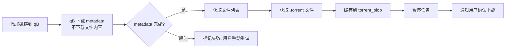

# 🧲 BitHoard 功能规格文档

> 最后更新：2026-07-04 | 版本：v0.1.0

---

## 一、剪贴板监控

### 1.1 自动识别

后台常驻运行，实时监听系统剪贴板变化，自动识别以下链接类型：

| 类型 | 匹配规则 |
|------|---------|
| 磁链 | `magnet:?xt=urn:btih:...` |
| 种子链接 | URL 以 `.torrent` 结尾 |
| 电驴链接 | `ed2k://...` |

### 1.2 去重策略

- 同一磁链重复复制 → **自动跳过**，提示"已存在"
- 去重判断以 `magnet_uri` 的 BTIH hash 为唯一键

### 1.3 来源识别（仅 Electron 桌面端）

- 检测剪贴板变化时，同步获取当前前台窗口进程名
- 进程名映射为友好名：
  - `WeChat.exe` → "微信"
  - `QQ.exe` → "QQ"
  - `msedge.exe` / `chrome.exe` / `firefox.exe` → "浏览器"
  - 无法识别 → "未知"
- Web 端该字段为空或显示 "Web"

### 1.4 全局快捷键捕获（仅 Electron 桌面端）

- 提供全局快捷键，手动触发"捕获当前剪贴板内容"
- 非链接类型的纯文本也可手动捕获，作为资源描述存入
- 快捷键可自定义，默认 `Ctrl+Shift+V`

### 1.5 拖拽支持（仅 Electron 桌面端）

- 支持拖入 `.torrent` 文件 → 自动解析并创建记录
- 支持拖入 URL 文本 / 磁链文本 → 同剪贴板识别逻辑

---

## 二、批量暂存区

### 2.1 触发条件

| 场景 | 行为 |
|------|------|
| 逐个复制 | 每个链接弹出独立 Toast，按时间排队 |
| 一次复制含多个链接 | 识别出多个链接后，进入**暂存区模式** |

### 2.2 暂存区交互

- Toast 显示 "检测到 N 个链接"，可展开为暂存区面板
- 暂存区中每条记录可：
  - 独立编辑标题、描述、来源、分类、标签
  - 独立粘贴截图
  - 勾选/取消勾选（决定哪些真正入库）
- 支持**批量操作**：
  - 批量打标签
  - 批量设置分类
  - 批量设置来源
- 500ms 内的连续剪贴板变化合入同一暂存区

### 2.3 状态管理

- 暂存区数据**直接入库**，标记 `status = ''draft''`
- 用户确认后标记 `status = ''active''`
- 即使崩溃，draft 数据不丢失
- 提供 "清理草稿" 功能，清理指定天数前的 draft

---

## 三、自定义 Toast 浮窗

### 3.1 布局

```
┌─────────────────────────────────────────┐
│ 🔗 检测到磁链                           │
│                                         │
│ magnet:?xt=urn:btih:ABCDEF123...        │
│                                         │
│ 来源: [微信 ▼]  分组: [未分组 ▼]        │
│                                         │
│ 标题: [________________________]        │
│ 描述: [________________________]        │
│                                         │
│ 📎 粘贴截图 (Ctrl+V) [缩略图预览区]      │
│                                         │
│ [立即下载]  [仅保存]  [忽略]  [展开>>>] │
└─────────────────────────────────────────┘
```

### 3.2 操作按钮

| 按钮 | 行为 |
|------|------|
| 立即下载 | 入库 + 调用 qBittorrent 添加任务 |
| 仅保存 | 入库标记 active，不下载 |
| 忽略 | 丢弃（如已入库 draft 则删除记录） |
| 展开>>> | 展开完整编辑面板，包含所有 meta 字段 |

### 3.3 截图粘贴

- 剪贴板中有图片时，`Ctrl+V` 直接粘贴到截图区
- 格式：PNG / JPG 原始二进制直接存 BLOB，不转 Base64
- 前端压缩后自动生成 256px 缩略图，原图+缩略图同时入库

---

## 四、资源管理

### 4.1 核心表（resource）

`resource` 表保持轻量，仅存储内容相关字段，下载信息拆分到独立子表：

| 字段 | 类型 | 说明 |
|------|------|------|
| `id` | INTEGER PK | 自增主键 |
| `magnet_uri` | TEXT UNIQUE | 磁链完整 URI |
| `torrent_blob` | BLOB | .torrent 文件缓存（可选，有就存） |
| `title` | TEXT | 标题 |
| `description` | TEXT | 文字描述 |
| `source_app` | TEXT | 来源应用（微信/QQ/浏览器/未知） |
| `category` | TEXT | 分类（影视/软件/书籍/音乐/其他） |
| `status` | TEXT | draft / active |
| `rating` | INTEGER | 评分 0-5（0=未评分） |
| `review` | TEXT | 文字评价 |
| `is_deleted` | INTEGER | 软删除标记 0/1 |
| `created_at` | TEXT | 创建时间 ISO8601 |
| `updated_at` | TEXT | 更新时间 ISO8601 |

**设计原则：** 下载是可选的，不下载就不产生 download 记录；删除下载记录后资源仍在，可重新下载。

### 4.2 截图（screenshots 子表）

| 字段 | 类型 | 说明 |
|------|------|------|
| `id` | INTEGER PK | 自增主键 |
| `resource_id` | INTEGER FK | 关联 resource.id |
| `image` | BLOB | 原图（PNG/JPG 原始二进制） |
| `thumbnail` | BLOB | 缩略图 256px |
| `order` | INTEGER | 排序序号 |
| `created_at` | TEXT | 创建时间 |

- 一个资源支持多张截图，不限制图片大小
- 前端粘贴时实时压缩生成缩略图，不限制原图尺寸
- 直接用 Sharp 处理，不转 Base64 中间格式

### 4.3 标签（tags）

```
tags                    resource_tags
┌──────────────┐       ┌────────────────┐
│ id (PK)      │       │ resource_id(FK)│
│ name         │◄──────│ tag_id(FK)     │
│ color        │       └────────────────┘
│ created_at   │
└──────────────┘
```

- 多对多关联，通过 `resource_tags` 中间表
- 预设常用标签：4K、HDR、杜比、字幕、原盘、Remux、x265、x264、官中 等
- 支持用户自定义标签，可选颜色标记

### 4.4 分组（groups）

```
groups                  resource_groups
┌──────────────┐       ┌────────────────┐
│ id (PK)      │       │ resource_id(FK)│
│ name         │◄──────│ group_id(FK)   │
│ description  │       └────────────────┘
│ cover (BLOB) │
│ created_at   │
└──────────────┘
```

- **扁平容器模型**，不设父子层级关系
- 多对多关联，一个资源可属于多个分组
- 分组可设置：名称、描述、封面图
- 使用场景示例："2024追番"、"经典电影收藏"、"纪录片"

### 4.5 分类

- 预设分类：影视、软件、书籍、音乐、其他
- 支持用户自定义扩展
- 单选（一个资源一个分类）

---

## 五、下载管理

### 5.1 下载子表（download）

下载信息完全独立于 `resource` 表：

| 字段 | 类型 | 说明 |
|------|------|------|
| `id` | INTEGER PK | 自增主键 |
| `resource_id` | INTEGER FK UNIQUE | 关联资源（一个资源最多一条下载记录） |
| `download_path` | TEXT | 下载目标路径 |
| `download_status` | TEXT | pending / downloading / paused / completed / deleted |
| `qb_task_hash` | TEXT | qBittorrent info_hash，用于 API 关联 |
| `total_size` | INTEGER | 总大小（字节） |
| `downloaded_size` | INTEGER | 已下载大小（字节） |
| `started_at` | TEXT | 开始时间 |
| `completed_at` | TEXT | 完成时间 |

- `resource_id` 加 UNIQUE 约束，一个资源最多一条下载记录
- 删除下载 → 删 download 行，resource 不动，可重新下载

### 5.2 qBittorrent 集成

**连接配置：**
- 支持本地（localhost）和远程（NAS/服务器）两种连接
- 配置项：URL、端口、用户名、密码
- 提供 "测试连接" 按钮验证配置
- 托盘图标 / Web UI 指示 qB 连接状态

**目标版本：** qBittorrent v4.5.0.10（固定，不做多版本兼容）
**实例数量：** 单实例

**支持的操作：**

| 操作 | API | 说明 |
|------|-----|------|
| 添加任务 | `/api/v2/torrents/add` | 传入磁链，自动开始 |
| 添加任务(暂停) | 同上 + `paused=true` | 添加后立即暂停 |
| 暂停 | `/api/v2/torrents/pause` | 暂停下载 |
| 恢复 | `/api/v2/torrents/resume` | 恢复下载 |
| 删除任务 | `/api/v2/torrents/delete` | 可选是否删除文件 |
| 获取属性 | `/api/v2/torrents/properties` | 获取单个种子属性 |
| 获取文件列表 | `/api/v2/torrents/files` | 获取种子内文件列表 |
| 获取信息 | `/api/v2/torrents/info` | 批量获取任务信息 |

**元数据自动补全流程：**



**进度推送策略：**
- 后端定时轮询 qB API 获取任务进度
- 通过 WebSocket 实时推送到前端
- **不存数据库**——进度、速度等临时数据仅内存传递
- 1 秒节流，避免高频写入

### 5.3 磁盘空间检查

- 添加下载任务前，检查目标路径所在磁盘剩余空间
- 默认阈值：剩余 < 10GB 时弹出警告
- **警告不阻止下载**，仅作提醒
- 不做定时检查（非实时磁盘监控）

---

## 六、TMDB 自动补全

### 6.1 触发方式

- 手动触发：资源详情页点击 "匹配 TMDB" 按钮
- 自动触发（可选）：资源创建后，若标题可解析出影视关键词，自动搜索

### 6.2 补全内容

| 字段 | TMDB 来源 |
|------|----------|
| 标题（规范化） | `title` (电影) / `name` (电视剧) |
| 简介 | `overview` |
| 海报 | `poster_path` → 下载存为截图 |
| 评分 | `vote_average` |
| 年份 | `release_date` / `first_air_date` |
| 类型标签 | 自动打 "电影" / "电视剧" 标签 |

### 6.3 匹配流程

- 从标题提取关键词，调用 TMDB Search API
- 返回前 5 个匹配结果，用户手动选择确认
- 确认后自动写入 title、description、海报、评分等字段
- 用户可后续手动修改

---

## 七、自动缩略图生成

- **触发时机：** 下载完成后
- **实现方式：** 调用 FFmpeg 从视频文件中抽取帧
- **抽取策略：** 默认取 10%、50%、90% 位置各一帧
- **存储：** 生成的缩略图存入 screenshots 表（与用户粘贴的截图同级）

---

## 八、文件列表缓存与全维度检索

### 8.1 文件列表缓存（files 表）

| 字段 | 类型 | 说明 |
|------|------|------|
| `id` | INTEGER PK | 自增主键 |
| `resource_id` | INTEGER FK | 关联 resource.id |
| `file_path` | TEXT | 文件在种子内的相对路径 |
| `file_size` | INTEGER | 文件大小（字节） |
| `file_index` | INTEGER | 文件在种子中的序号 |

- 元数据获取完成或 .torrent 解析后自动写入
- 下载完成后可刷新实际文件列表

### 8.2 检索体系

**文件名反向搜索：**
- 输入文件名片段 → 搜索 `files.file_path` → 返回包含该文件的资源列表
- 支持模糊匹配和通配符（`%keyword%`）
- 场景："我记得有个叫 `avatar.mkv` 的文件，在哪个磁链里来着？"

**Meta 全文搜索：**
- 搜索范围：`title`、`description`、`review`
- 支持中文关键词，LIKE 模糊匹配

**高级筛选（AND 组合）：**

| 维度 | 条件 |
|------|------|
| 评分 | 范围 0-5，如 "≥3星" |
| 标签 | AND/OR 组合，如 "4K AND HDR" |
| 下载状态 | 未下载 / 下载中 / 已完成 / 有下载记录 |
| 分类 | 影视 / 软件 / 书籍 / 音乐 / 其他 |
| 日期范围 | 创建时间 / 下载完成时间 |
| 来源应用 | 微信 / QQ / 浏览器 / 未知 |
| 分组 | 属于指定分组 |

**保存的搜索（智能列表）：**
- 将当前筛选条件保存为命名搜索
- 显示在侧边栏快捷入口
- 点击即应用该组筛选条件

---

## 九、操作日志

### 9.1 history 表

| 字段 | 类型 | 说明 |
|------|------|------|
| `id` | INTEGER PK | 自增主键 |
| `resource_id` | INTEGER FK | 关联 resource.id |
| `action` | TEXT | 操作类型 |
| `detail` | TEXT(JSON) | 操作详情 JSON |
| `created_at` | TEXT | 操作时间 |

### 9.2 操作类型

| action | 说明 |
|--------|------|
| `created` | 新建资源（含来源、磁链信息） |
| `updated` | 编辑元数据（记录变更字段） |
| `screenshot_added` | 添加截图 |
| `download_started` | 开始下载 |
| `download_completed` | 下载完成（记录路径、大小、耗时） |
| `download_deleted` | 删除下载记录 |
| `download_paused` | 暂停下载 |
| `download_resumed` | 恢复下载 |
| `rated` | 评分/评价变更 |
| `deleted` | 软删除 |
| `restored` | 恢复 |

- "简单做做" —— 只记录关键操作节点
- 不做详细的字段级变更审计

---

## 十、鉴权与安全

### 10.1 用户模型

- **单用户**系统，不设多用户体系
- 默认管理员账号，密码通过环境变量 `ADMIN_PASSWORD` 配置
- 可在设置页面修改密码

### 10.2 JWT 认证

- 登录接口：`POST /api/auth/login`，Body: `{ password }`
- 登录成功返回 JWT Token
- API 请求 Header: `Authorization: Bearer <token>`
- Token 有效期可配置（默认 7 天）
- Web 端持久化存储 Token（localStorage）

### 10.3 IP 白名单

- 配置允许免登录访问的 IP 或 CIDR 段
- 白名单内请求直接放行，白名单外需 JWT
- 默认白名单：`127.0.0.1`、`::1`、`localhost`
- 局域网场景可扩展：`192.168.1.0/24`

### 10.4 数据安全

- 数据库不加密（按用户决策）
- 图片直接以 PNG/JPG BLOB 存 SQLite
- 整体备份 = 复制 `.db` 文件即可

---

## 十一、数据导入导出

### 11.1 打包导出

- 整个 SQLite 数据库文件完整导出
- 包含：资源、截图（BLOB）、标签、分组、下载记录、日志
- 导出为单个 `.bithoard` 文件（本质是 SQLite 副本 + manifest）
- 导出时可选是否包含截图（减小文件大小）

### 11.2 导入

- 选择 `.bithoard` 文件导入
- 支持两种模式：
  - **合并模式**：追加到现有库（重复磁链跳过）
  - **覆盖模式**：清空现有库后导入

### 11.3 暂不实现

- 从其他工具迁移（Sonarr/Radarr 等）
- 导出 JSON/CSV/Markdown 分享格式
- 云同步（OneDrive/iCloud 并发风险）

---

## 十二、系统托盘（Electron 桌面端）

### 12.1 托盘图标

- 状态指示：qB 在线 / qB 离线 / 监控中
- 右键菜单：
  - 🖥️ 打开主界面
  - ⏸️ 暂停/恢复剪贴板监控
  - 📊 qB 连接状态（在线/离线，点击测试连接）
  - 📋 最近捕获（最近 5 条磁链标题）
  - ❌ 退出

### 12.2 启动行为

- 支持开机自启（配置项，默认关闭）
- 启动后默认最小化到系统托盘
- 首次运行时打开主界面引导 qB 连接配置

---

## 十三、Web 远程访问

### 13.1 访问方式

| 场景 | 地址 |
|------|------|
| Electron 内嵌 | `http://localhost:13002` |
| 本机浏览器 | `http://localhost:13002` |
| 局域网远程 | `http://<主机IP>:13002` |

- 后端端口默认 `13002`，可配置
- WebSocket 复用同一 HTTP 端口
- 远程访问需 JWT 鉴权（IP 白名单内除外）

### 13.2 SPA 路由

| 路由 | 页面 |
|------|------|
| `/` | 全部资源（首页） |
| `/resource/:id` | 资源详情 |
| `/downloads` | 下载管理 |
| `/settings` | 设置（qB 连接、白名单、密码） |
| `/search` | 高级搜索 |

---

## 十四、UI/UX

### 14.1 视图模式

| 模式 | 适用场景 |
|------|---------|
| 列表视图 | 紧凑表格，显示标题、分类、评分、状态、来源，适合批量操作 |
| 卡片视图 | 卡片布局，展示缩略图、标题、标签、评分，适合浏览 |

- 默认列表视图，用户可切换，偏好记录在 localStorage

### 14.2 暗色模式

- 三种模式：亮色 / 暗色 / 跟随系统
- 使用 CSS 变量 + `prefers-color-scheme` 媒体查询
- 偏好记录在 localStorage

### 14.3 批量操作

- 列表支持多选：Shift（范围选择）、Ctrl（多选）
- 批量操作栏：批量打标签、改分类、改分组、评分、删除

### 14.4 键盘快捷键

| 快捷键 | 功能 |
|--------|------|
| `Ctrl+K` | 全局搜索聚焦 |
| `Ctrl+N` | 手动添加资源 |
| `Delete` | 删除选中项 |
| `Escape` | 关闭弹窗 / 取消操作 |

---

## 十五、移动端预留

### 15.1 API 设计原则

- 所有接口返回标准 JSON
- 图片接口支持 `?size=thumb|small|original` 参数，移动端可只拉缩略图
- JWT Token 有效期可配置
- CORS 配置允许跨域

### 15.2 暂不实现

- 移动端 App（iOS/Android）
- PWA 离线支持
- 但 API 设计保持移动端友好，浏览器亦可访问

---

## 十六、并发与性能

### 16.1 SQLite 写入策略

- 开启 **WAL 模式**（Write-Ahead Logging），允许读写并发
- 所有写入操作通过**内存队列**排队执行
- qB 进度更新**不写库**，仅 WebSocket 内存推送
- 高频场景（qB 轮询）与低频场景（用户编辑）自然隔离

### 16.2 图片处理

- Sharp 库处理，高性能
- 前端粘贴 → 实时压缩缩略图 → 原图+缩略图同时上传
- 不限制图片大小和数量，但前台提供数量提示

---

## 十七、优先级总览

| 标记 | 说明 |
|------|------|
| 🔴 P0 | 核心必做，MVP 交付范围 |
| 🟡 P1 | 重要功能，MVP 后优先 |
| 🟢 P2 | 增强功能，后续迭代 |
| ⚪ P3 | 远期规划 |

| # | 功能摘要 | 优先级 |
|---|---------|--------|
| 1 | 剪贴板监控（磁链/种子/ed2k 识别 + 去重） | 🔴 P0 |
| 2 | 全局快捷键 + 拖拽添加 | 🔴 P0 |
| 3 | 批量识别 + 暂存区（draft 入库） | 🔴 P0 |
| 4 | 自定义 Toast（内嵌编辑 + 截图粘贴） | 🔴 P0 |
| 5 | 来源应用自动识别 | 🟡 P1 |
| 6 | 种子元数据获取（文件列表/大小/torrent 缓存） | 🔴 P0 |
| 7 | TMDB 自动匹配（海报/简介/评分） | 🟡 P1 |
| 8 | 下载后视频缩略图生成 | 🟢 P2 |
| 9 | 分类 + 标签 + 分组（N:M 扁平容器） | 🔴 P0 |
| 10 | 评分(0-5) + 文字评价 | 🔴 P0 |
| 11 | qBittorrent 全集成（添加/暂停/删除/进度WS/元数据） | 🔴 P0 |
| 12 | 文件名反向搜索 + Meta全文 + 高级筛选 + 保存搜索 | 🔴 P0 |
| 13 | 磁盘空间检查（下载前警告，不阻止） | 🟡 P1 |
| 14 | 操作日志（关键节点） | 🟢 P2 |
| 15 | 数据库打包导出/导入（.bithoard 文件） | 🟡 P1 |
| 16 | 系统托盘常驻（右键菜单/开机自启） | 🔴 P0 |
| 17 | Web 远程访问 + JWT + IP 白名单 | 🟡 P1 |
| 18 | 暗色模式 + 列表/卡片视图切换 | 🟡 P1 |
| 19 | 移动端 API 预留（size 参数/CORS） | ⚪ P3 |
