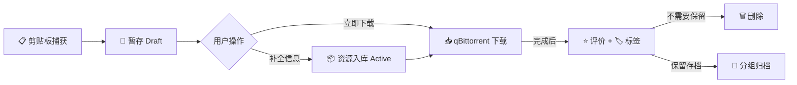
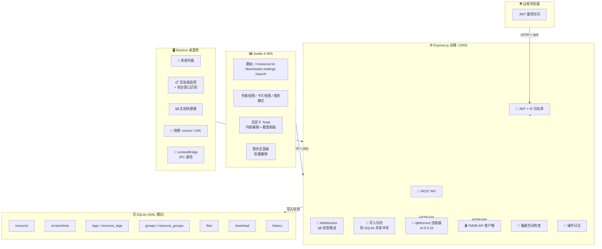
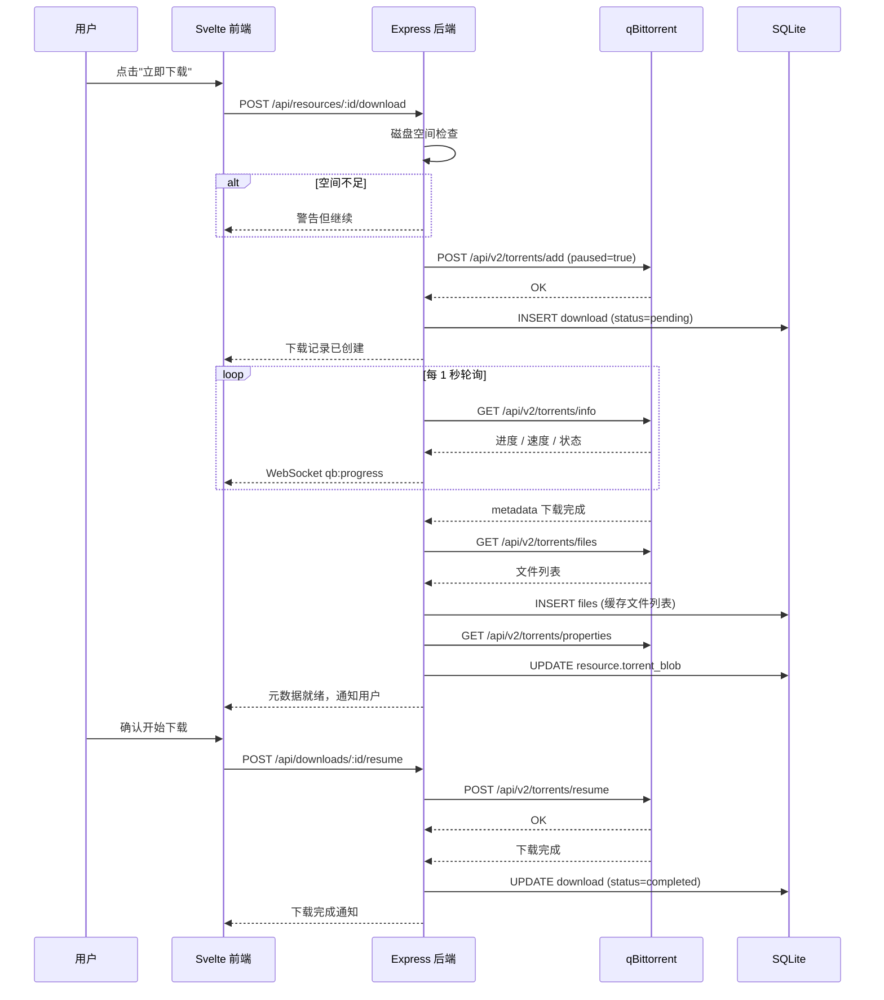

# 🧲 BitHoard 项目规划文档

> 最后更新：2026-07-04 | 版本：v0.1.0

---

## 一、项目概述

**BitHoard** 是一款磁链资源管理与下载工具，以"先收集，后整理"为核心思路。用户从各种渠道复制磁链后，BitHoard 自动捕获并创建资源卡片，随后用户可补充元信息、截图、评价，并可对接 qBittorrent 直接下载。

### 核心理念



---

## 二、技术架构

### 2.1 总览



### 2.2 技术栈明细

| 层 | 技术 | 版本 | 用途 |
|---|------|------|------|
| 运行时 | Node.js | 20 LTS | 统一运行时 |
| 包管理 | pnpm | 9 | Workspace monorepo |
| 后端框架 | Express.js | 4 | HTTP API + WebSocket |
| 数据库 | better-sqlite3 | latest | 同步 SQLite，WAL 模式 |
| 前端框架 | Svelte | 4 | 响应式 UI |
| 构建工具 | Vite | 5 | 前端开发 & 构建 |
| 图标 | lucide-svelte | latest | SVG 图标 |
| 图片处理 | Sharp | latest | 缩略图生成 |
| 桌面壳 | Electron | 31 | 剪贴板监控、托盘、快捷键 |
| WebSocket | express-ws | latest | 实时进度推送 |
| 鉴权 | jsonwebtoken | latest | JWT 签发与验证 |
| 种子解析 | parse-torrent | latest | .torrent 文件解析 |

### 2.3 目录结构

```
BitHoard/
├── pnpm-workspace.yaml          # pnpm monorepo 配置
├── package.json                 # 根 package.json (Electron + 脚本)
├── .npmrc                       # pnpm 配置
├── .node-version                # Node 版本锁定
├── README.md                    # 项目说明
├── docs/
│   ├── FEATURES.md              # 功能规格文档
│   └── PROJECT_PLAN.md          # 本文件
├── server/                      # 后端服务
│   ├── package.json
│   ├── src/
│   │   ├── index.js             # Express 入口
│   │   ├── config.js            # 配置管理 (env + 默认值)
│   │   ├── database/
│   │   │   ├── connection.js    # SQLite 连接 (WAL)
│   │   │   ├── schema.js        # 建表 DDL
│   │   │   └── queue.js         # 写入队列
│   │   ├── middleware/
│   │   │   ├── auth.js          # JWT 鉴权中间件
│   │   │   └── ipWhitelist.js   # IP 白名单中间件
│   │   ├── routes/
│   │   │   ├── auth.js          # 登录/登出
│   │   │   ├── resources.js     # 资源 CRUD
│   │   │   ├── screenshots.js   # 截图上传/缩略图
│   │   │   ├── tags.js          # 标签 CRUD
│   │   │   ├── groups.js        # 分组 CRUD
│   │   │   ├── downloads.js     # 下载记录
│   │   │   ├── search.js        # 搜索接口
│   │   │   ├── qbittorrent.js   # qB 操作代理
│   │   │   ├── tmdb.js          # TMDB 查询
│   │   │   └── export.js        # 导入导出
│   │   ├── services/
│   │   │   ├── qbittorrent.js   # qB API 封装
│   │   │   ├── tmdb.js          # TMDB API 封装
│   │   │   └── disk.js          # 磁盘空间检查
│   │   └── websocket/
│   │       └── index.js         # WS 连接管理 + qB 进度广播
│   └── data/                    # SQLite 数据库文件 (gitignore)
├── web/                         # Svelte 前端
│   ├── package.json
│   ├── index.html
│   ├── vite.config.js
│   ├── svelte.config.js
│   └── src/
│       ├── main.js              # SPA 入口
│       ├── App.svelte           # 根组件 (路由 + 布局)
│       ├── lib/
│       │   ├── api.js           # API 请求封装 (fetch + JWT)
│       │   ├── ws.js            # WebSocket 客户端
│       │   └── stores.js        # Svelte stores (auth/theme/toast)
│       ├── routes/
│       │   ├── Home.svelte      # 首页：全部资源
│       │   ├── ResourceDetail.svelte  # 资源详情
│       │   ├── Downloads.svelte # 下载管理
│       │   ├── Settings.svelte  # 设置页
│       │   └── Search.svelte    # 高级搜索
│       └── components/
│           ├── layout/          # 侧边栏、顶栏、布局
│           ├── resource/        # 资源卡片、列表行、详情面板
│           ├── toast/           # Toast 浮窗、暂存区
│           ├── search/          # 搜索栏、高级筛选
│           ├── download/        # 下载进度条、状态指示
│           └── common/          # 通用组件 (Modal, Button, Tag 等)
└── electron/                    # Electron 主进程
    ├── main.js                  # 主进程入口
    ├── preload.js               # 预加载脚本 (contextBridge)
    ├── clipboard.js             # 剪贴板监控
    ├── tray.js                  # 系统托盘
    ├── shortcuts.js             # 全局快捷键
    └── window.js                # 窗口管理
```

---

## 三、数据模型

### 3.1 ER 图

```mermaid
erDiagram
    resource ||--o{ screenshot : "1:N"
    resource ||--o{ resource_tag : "1:N"
    tag ||--o{ resource_tag : "1:N"
    resource ||--o{ resource_group : "1:N"
    group ||--o{ resource_group : "1:N"
    resource ||--o| download : "1:0..1"
    resource ||--o{ file : "1:N"
    resource ||--o{ history : "1:N"

    resource {
        int id PK
        string magnet_uri UK
        blob torrent_blob
        string title
        string description
        string source_app
        string category
        string status
        int rating
        string review
        int is_deleted
        string created_at
        string updated_at
    }

    screenshot {
        int id PK
        int resource_id FK
        blob image
        blob thumbnail
        int order
        string created_at
    }

    tag {
        int id PK
        string name
        string color
        string created_at
    }

    resource_tag {
        int resource_id FK
        int tag_id FK
    }

    group {
        int id PK
        string name
        string description
        blob cover
        string created_at
    }

    resource_group {
        int resource_id FK
        int group_id FK
    }

    download {
        int id PK
        int resource_id FK_UK
        string download_path
        string download_status
        string qb_task_hash
        int total_size
        int downloaded_size
        string started_at
        string completed_at
    }

    file {
        int id PK
        int resource_id FK
        string file_path
        int file_size
        int file_index
    }

    history {
        int id PK
        int resource_id FK
        string action
        string detail
        string created_at
    }
```

### 3.2 建表 DDL

```sql
-- 开启 WAL 模式
PRAGMA journal_mode=WAL;
PRAGMA foreign_keys=ON;

CREATE TABLE resource (
    id INTEGER PRIMARY KEY AUTOINCREMENT,
    magnet_uri TEXT UNIQUE NOT NULL,
    torrent_blob BLOB,
    title TEXT DEFAULT '',
    description TEXT DEFAULT '',
    source_app TEXT DEFAULT '未知',
    category TEXT DEFAULT '其他',
    status TEXT DEFAULT 'draft' CHECK(status IN ('draft', 'active')),
    rating INTEGER DEFAULT 0 CHECK(rating >= 0 AND rating <= 5),
    review TEXT DEFAULT '',
    is_deleted INTEGER DEFAULT 0,
    created_at TEXT DEFAULT (datetime('now')),
    updated_at TEXT DEFAULT (datetime('now'))
);

CREATE INDEX idx_resource_status ON resource(status);
CREATE INDEX idx_resource_category ON resource(category);
CREATE INDEX idx_resource_rating ON resource(rating);
CREATE INDEX idx_resource_source ON resource(source_app);
CREATE INDEX idx_resource_created ON resource(created_at);

CREATE TABLE screenshot (
    id INTEGER PRIMARY KEY AUTOINCREMENT,
    resource_id INTEGER NOT NULL REFERENCES resource(id) ON DELETE CASCADE,
    image BLOB NOT NULL,
    thumbnail BLOB NOT NULL,
    "order" INTEGER DEFAULT 0,
    created_at TEXT DEFAULT (datetime('now'))
);

CREATE INDEX idx_screenshot_resource ON screenshot(resource_id);

CREATE TABLE tag (
    id INTEGER PRIMARY KEY AUTOINCREMENT,
    name TEXT UNIQUE NOT NULL,
    color TEXT DEFAULT '#6366f1',
    created_at TEXT DEFAULT (datetime('now'))
);

CREATE TABLE resource_tag (
    resource_id INTEGER NOT NULL REFERENCES resource(id) ON DELETE CASCADE,
    tag_id INTEGER NOT NULL REFERENCES tag(id) ON DELETE CASCADE,
    PRIMARY KEY (resource_id, tag_id)
);

CREATE TABLE "group" (
    id INTEGER PRIMARY KEY AUTOINCREMENT,
    name TEXT NOT NULL,
    description TEXT DEFAULT '',
    cover BLOB,
    created_at TEXT DEFAULT (datetime('now'))
);

CREATE TABLE resource_group (
    resource_id INTEGER NOT NULL REFERENCES resource(id) ON DELETE CASCADE,
    group_id INTEGER NOT NULL REFERENCES "group"(id) ON DELETE CASCADE,
    PRIMARY KEY (resource_id, group_id)
);

CREATE TABLE download (
    id INTEGER PRIMARY KEY AUTOINCREMENT,
    resource_id INTEGER UNIQUE NOT NULL REFERENCES resource(id) ON DELETE CASCADE,
    download_path TEXT DEFAULT '',
    download_status TEXT DEFAULT 'pending' CHECK(download_status IN ('pending', 'downloading', 'paused', 'completed', 'deleted')),
    qb_task_hash TEXT,
    total_size INTEGER DEFAULT 0,
    downloaded_size INTEGER DEFAULT 0,
    started_at TEXT,
    completed_at TEXT
);

CREATE TABLE "file" (
    id INTEGER PRIMARY KEY AUTOINCREMENT,
    resource_id INTEGER NOT NULL REFERENCES resource(id) ON DELETE CASCADE,
    file_path TEXT NOT NULL,
    file_size INTEGER DEFAULT 0,
    file_index INTEGER DEFAULT 0
);

CREATE INDEX idx_file_resource ON "file"(resource_id);
CREATE INDEX idx_file_path ON "file"(file_path);

CREATE TABLE history (
    id INTEGER PRIMARY KEY AUTOINCREMENT,
    resource_id INTEGER REFERENCES resource(id) ON DELETE SET NULL,
    action TEXT NOT NULL,
    detail TEXT DEFAULT '{}',
    created_at TEXT DEFAULT (datetime('now'))
);

CREATE INDEX idx_history_resource ON history(resource_id);
CREATE INDEX idx_history_action ON history(action);
CREATE INDEX idx_history_created ON history(created_at);
```

---

## 四、API 设计

### 4.1 基础规范

| 项目 | 规范 |
|------|------|
| 基础路径 | `/api` |
| 数据格式 | JSON |
| 鉴权方式 | `Authorization: Bearer <JWT>` |
| 分页 | `?page=1&pageSize=20` |
| 响应格式 | `{ success: true, data: ... }` 或 `{ success: false, error: "..." }` |

### 4.2 接口清单

#### 认证

| 方法 | 路径 | 说明 |
|------|------|------|
| POST | `/api/auth/login` | 密码登录，返回 JWT |
| POST | `/api/auth/logout` | 登出（客户端清除 Token） |
| PUT | `/api/auth/password` | 修改管理员密码 |

#### 资源 CRUD

| 方法 | 路径 | 说明 |
|------|------|------|
| GET | `/api/resources` | 分页列表，支持筛选参数 |
| GET | `/api/resources/:id` | 资源详情（含截图/标签/分组/文件列表） |
| POST | `/api/resources` | 创建资源（从磁链） |
| PUT | `/api/resources/:id` | 编辑资源元数据 |
| DELETE | `/api/resources/:id` | 软删除（is_deleted=1） |
| POST | `/api/resources/batch` | 批量创建（暂存区提交） |
| PATCH | `/api/resources/batch` | 批量编辑（标签/分类/分组） |

#### 截图

| 方法 | 路径 | 说明 |
|------|------|------|
| POST | `/api/resources/:id/screenshots` | 上传截图（multipart） |
| DELETE | `/api/screenshots/:id` | 删除截图 |
| PATCH | `/api/screenshots/reorder` | 调整截图排序 |

#### 标签

| 方法 | 路径 | 说明 |
|------|------|------|
| GET | `/api/tags` | 标签列表 |
| POST | `/api/tags` | 创建标签 |
| DELETE | `/api/tags/:id` | 删除标签 |

#### 分组

| 方法 | 路径 | 说明 |
|------|------|------|
| GET | `/api/groups` | 分组列表 |
| POST | `/api/groups` | 创建分组 |
| PUT | `/api/groups/:id` | 编辑分组 |
| DELETE | `/api/groups/:id` | 删除分组 |
| POST | `/api/groups/:id/resources` | 添加资源到分组 |
| DELETE | `/api/groups/:id/resources/:resourceId` | 从分组移除资源 |

#### 搜索

| 方法 | 路径 | 说明 |
|------|------|------|
| GET | `/api/search` | 综合搜索（q, category, rating_min, rating_max, tags, groups, status, source, date_from, date_to） |
| GET | `/api/search/files` | 文件名反向搜索 |
| POST | `/api/search/saved` | 保存搜索条件 |
| GET | `/api/search/saved` | 获取已保存的搜索 |

#### 下载 & qBittorrent

| 方法 | 路径 | 说明 |
|------|------|------|
| POST | `/api/resources/:id/download` | 创建下载记录 + 添加 qB 任务 |
| GET | `/api/downloads` | 下载记录列表 |
| DELETE | `/api/downloads/:id` | 删除下载记录（可选删除 qB 任务） |
| POST | `/api/downloads/:id/pause` | 暂停下载 |
| POST | `/api/downloads/:id/resume` | 恢复下载 |
| GET | `/api/qb/status` | qB 连接状态 |
| POST | `/api/qb/test` | 测试 qB 连接 |
| PUT | `/api/qb/config` | 更新 qB 连接配置 |

#### TMDB

| 方法 | 路径 | 说明 |
|------|------|------|
| GET | `/api/tmdb/search?q=` | 搜索 TMDB |
| POST | `/api/resources/:id/tmdb-match` | 将 TMDB 结果应用到资源 |

#### 导入导出

| 方法 | 路径 | 说明 |
|------|------|------|
| GET | `/api/export` | 导出整个数据库 |
| POST | `/api/import` | 导入 .bithoard 文件 |

#### 其他

| 方法 | 路径 | 说明 |
|------|------|------|
| GET | `/api/stats` | 统计概览（总数/已下载/评分分布等） |
| GET | `/api/history` | 操作日志列表 |
| GET | `/api/config` | 获取当前配置（qB/白名单等，不含密码） |

---

## 五、WebSocket 通信

### 5.1 连接

```
ws://localhost:13002/ws?token=<JWT>
```

### 5.2 服务端 → 客户端消息

| 事件 | 格式 | 说明 |
|------|------|------|
| `qb:progress` | `{ hash, progress, dlspeed, eta, state, ... }` | 下载进度（1s 节流） |
| `qb:status` | `{ connected: true/false }` | qB 连接状态变化 |
| `clipboard:new` | `{ magnet, sourceApp, count }` | 桌面端剪贴板新链接 |

### 5.3 客户端 → 服务端消息

| 事件 | 说明 |
|------|------|
| `subscribe:progress` | 订阅指定 hash 的进度 |

---

## 六、Electron 主进程功能

### 6.1 剪贴板监控

- 启动时注册 `clipboard.on('changed')` 事件
- 每次剪贴板变化，读取文本内容
- 用正则匹配磁链/种子/ed2k 链接
- 检测前台窗口进程名 → 映射来源
- 通过 IPC 发送给渲染进程 → 渲染进程调用后端 API 创建 draft
- 500ms 去抖：连续变化合并为一次

### 6.2 系统托盘

- 托盘图标根据 qB 连接状态显示不同颜色
- 右键菜单：打开主界面 / 暂停监控 / qB 状态 / 最近捕获 / 退出
- 点击托盘图标 → 显示/隐藏主窗口
- 关闭窗口 → 最小化到托盘

### 6.3 全局快捷键

- `Ctrl+Shift+V`：手动捕获剪贴板内容（包括非链接文本）
- `Ctrl+Shift+H`：显示/隐藏 BitHoard 窗口
- 快捷键在设置页面可自定义

### 6.4 拖拽

- 窗口接受 `.torrent` 文件拖入 → 解析 → 创建资源
- 接受文本拖入 → 同剪贴板识别逻辑

### 6.5 IPC 通道

| 通道 | 方向 | 说明 |
|------|------|------|
| `clipboard:link-detected` | Main → Renderer | 检测到新链接 |
| `clipboard:status-changed` | Main → Renderer | 监控状态变化 |
| `window:minimize-to-tray` | Renderer → Main | 最小化到托盘 |
| `app:quit` | Renderer → Main | 退出应用 |
| `shortcut:capture` | Main → Renderer | 全局快捷键触发 |

---

## 七、写入队列设计

### 7.1 设计思路

SQLite 单写者的特性决定了高并发下需要队列化写入。设计一个内存队列，所有数据库写操作入队串行执行，读操作直接执行（WAL 模式下读写不互斥）。

### 7.2 队列结构

```javascript
class WriteQueue {
    constructor() {
        this.queue = [];        // 待执行的写入任务
        this.processing = false; // 是否正在处理
    }

    // 入队一个写入操作，返回 Promise
    enqueue(fn) {
        return new Promise((resolve, reject) => {
            this.queue.push({ fn, resolve, reject });
            this.process();
        });
    }

    async process() {
        if (this.processing) return;
        this.processing = true;
        while (this.queue.length > 0) {
            const { fn, resolve, reject } = this.queue.shift();
            try {
                const result = await fn();
                resolve(result);
            } catch (e) {
                reject(e);
            }
        }
        this.processing = false;
    }
}
```

### 7.3 使用场景

| 场景 | 入队 | 不入队 |
|------|------|--------|
| 创建资源 | ✅ | |
| 编辑元数据 | ✅ | |
| 上传截图 | ✅ | |
| 添加标签关联 | ✅ | |
| 下载状态变更 | ✅ | |
| 操作日志 | ✅ | |
| 读取资源列表 | | ✅ |
| 搜索 | | ✅ |
| qB 进度数据 | | N/A（不写库） |

---

## 八、qBittorrent 集成流程

### 8.1 添加下载任务



### 8.2 删除下载

- 用户可选择是否同时删除 qB 任务
- 删除 qB 任务时可选择是否删除硬盘文件
- 删除后 download 记录移除，resource 保留

---

## 九、前端状态管理

### 9.1 Svelte Stores

| Store | 用途 | 持久化 |
|-------|------|--------|
| `authToken` | JWT 登录态 | localStorage |
| `theme` | 亮色/暗色/跟随系统 | localStorage |
| `viewMode` | 列表/卡片视图 | localStorage |
| `toasts` | Toast 通知队列 | 仅内存 |
| `stagingItems` | 暂存区项目 | 仅内存 |
| `qbStatus` | qB 连接状态 | 仅内存 |
| `downloadProgress` | 下载进度 Map<hash, info> | 仅内存 |

### 9.2 路由结构

```
/                    → Home.svelte          (全部资源 + 搜索)
/resource/:id        → ResourceDetail.svelte (资源详情 + 评价 + 下载操作)
/downloads           → Downloads.svelte      (下载管理 + 进度)
/settings            → Settings.svelte       (qB配置 + 白名单 + 密码 + 导出)
/search              → Search.svelte         (高级搜索)
```

---

## 十、开发阶段与里程碑

### Phase 0：项目脚手架 ✅ (已完成)

- [x] pnpm monorepo 搭建
- [x] Electron 主进程骨架
- [x] Express 服务端骨架
- [x] Svelte + Vite 前端骨架
- [x] SQLite 数据库初始化
- [x] 基础路由与页面框架
- [x] JWT 鉴权 + IP 白名单

### Phase 1：核心 MVP (P0)

| # | 任务 | 预估 |
|---|------|------|
| 1.1 | 剪贴板监控 + 磁链识别 + 去重 | 2d |
| 1.2 | 资源 CRUD API + 资源列表/详情页 | 3d |
| 1.3 | 暂存区：批量识别 + draft 状态管理 | 2d |
| 1.4 | 自定义 Toast（内嵌编辑 + 截图粘贴） | 2d |
| 1.5 | 标签系统（CRUD + N:M 关联 + UI） | 1d |
| 1.6 | 分组系统（CRUD + N:M 关联 + UI） | 1d |
| 1.7 | 评分 + 评价（UI + API） | 1d |
| 1.8 | qBittorrent 集成：添加/暂停/恢复/删除 | 3d |
| 1.9 | qB 元数据获取 + torrent 缓存 + 文件列表缓存 | 2d |
| 1.10 | WebSocket qB 进度推送 | 1d |
| 1.11 | 搜索：Meta 全文 + 文件名反向搜索 | 2d |
| 1.12 | 系统托盘 + 全局快捷键 + 拖拽 | 2d |

**Phase 1 预估：约 22 人天**

### Phase 2：重要功能 (P1)

| # | 任务 | 预估 |
|---|------|------|
| 2.1 | 来源应用自动识别 | 1d |
| 2.2 | TMDB 自动匹配（搜索 + 补全） | 2d |
| 2.3 | 高级筛选面板 + 保存搜索 | 2d |
| 2.4 | 磁盘空间检查 | 0.5d |
| 2.5 | 数据打包导出/导入 | 1d |
| 2.6 | 暗色模式完善 | 1d |
| 2.7 | 列表/卡片视图切换 | 0.5d |
| 2.8 | 批量操作（多选 + 批量编辑） | 1d |

**Phase 2 预估：约 9 人天**

### Phase 3：增强功能 (P2)

| # | 任务 | 预估 |
|---|------|------|
| 3.1 | 下载后 FFmpeg 视频缩略图生成 | 2d |
| 3.2 | 操作日志 UI 展示 | 1d |
| 3.3 | 统计仪表板 | 1d |

**Phase 3 预估：约 4 人天**

### Phase 4：未来规划 (P3)

| # | 任务 |
|---|------|
| 4.1 | 移动端 App / PWA |
| 4.2 | RSS 订阅自动入库 |
| 4.3 | 种子健康检查 |
| 4.4 | 多 qB 实例支持 |

---

## 十一、配置项

| 环境变量 | 说明 | 默认值 |
|----------|------|--------|
| `PORT` | 服务端口 | `13002` |
| `HOST` | 绑定地址 | `127.0.0.1` |
| `JWT_SECRET` | JWT 签名密钥 | 随机生成 |
| `JWT_EXPIRES_IN` | Token 有效期 | `7d` |
| `ADMIN_PASSWORD` | 管理员密码 | `admin` |
| `QBITTORRENT_URL` | qBittorrent 地址 | `http://localhost:8080` |
| `QBITTORRENT_USERNAME` | qB 用户名 | `admin` |
| `QBITTORRENT_PASSWORD` | qB 密码 | — |
| `TMDB_API_KEY` | TMDB API 密钥 | — |
| `IP_WHITELIST` | IP 白名单（逗号分隔） | `127.0.0.1,::1,localhost` |
| `DATA_DIR` | 数据存储目录 | `data/` |
| `DISK_SPACE_WARN_GB` | 磁盘空间警告阈值(GB) | `10` |

---

## 十二、风险与约束

| 风险 | 影响 | 缓解措施 |
|------|------|---------|
| SQLite 并发写入 | 写入阻塞 | WAL 模式 + 写入队列 + qB 进度不写库 |
| qB API 变更 | 集成失效 | 固定版本 v4.5.0.10 |
| 大 BLOB 导致 DB 文件过大 | 性能下降 | 不限制但提供导出时排除截图的选项 |
| Electron 跨平台兼容 | macOS/Linux 行为差异 | 阶段性仅支持 Windows，后续适配 |
| DHT 元数据获取超时 | 无法获取文件列表 | 超时重试 + 用户手动重试 |

---

## 十三、开发约定

> 详见 `rules/` 目录各 `.mdc` 文件

- 🧠 思维语言：中文
- 💻 终端环境：PowerShell
- 🌐 终端代理：`http://127.0.0.1:1080`
- 📝 注释语言：中文
- 📊 图表格式：Mermaid
